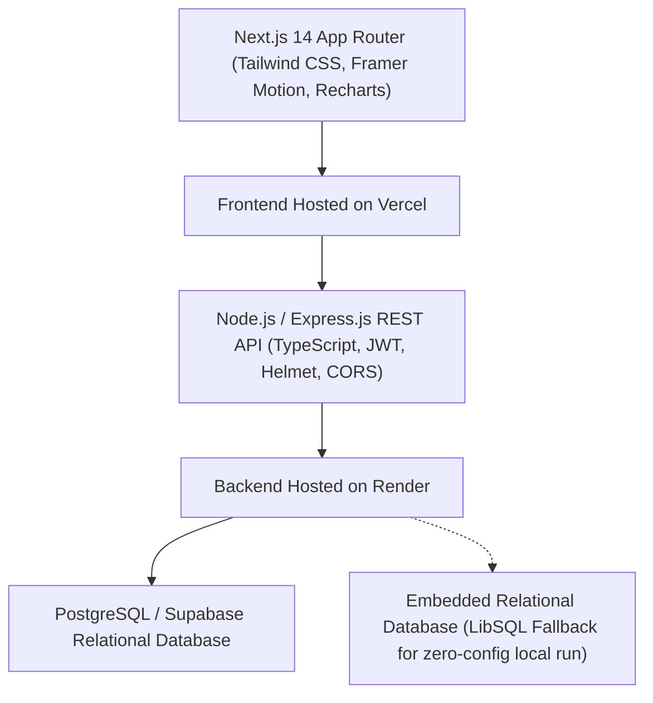

# Centrala National High School (CNHS)
## Extracurricular Activities and Student Development System (CNHS StudentX)
*Location: Surallah, South Cotabato, Region XII, Philippines*

---

## 🏛️ Executive Summary & Institutional Context
The **Centrala National High School Extracurricular Activities and Student Development System (CNHS StudentX)** is a full-stack, enterprise-grade educational SaaS platform designed specifically for **Centrala National High School** in Surallah, South Cotabato. 

The system solves critical operational problems faced by schools:
- **Fragmented Club Management:** Centralizes extracurricular programs across student government, journalism, STEM, varsity athletics, and humanitarian outreach.
- **Lost Participation & Attendance Disputes:** Implements fraud-resistant, time-windowed **QR Code attendance sessions** with live validation and automated attendance percentages and streak counters.
- **Disorganized Student Accomplishments:** Generates a permanent **Digital Participation Portfolio** with verified credentials, chronological development milestones, and publicly authenticable certificates.
- **Disconnected Student Interests:** Features a rule-based **Smart Recommendation Engine** matching student grade eligibility, declared competencies, and personal interests with active school activities.
- **Unverified Credentials:** Provides official certificate issuance with cryptographic certificate verification codes and printable format.

---

## 🏗️ System Architecture



### Technology Stack
- **Frontend:**
  - **Framework:** Next.js 14 (App Router, React 18, TypeScript)
  - **Styling & UI:** Tailwind CSS, custom design tokens, Lucide React icons
  - **Animations & Micro-interactions:** Framer Motion, Canvas Confetti
  - **Data Visualization:** Recharts (Area charts, Bar charts, Donut charts)
  - **Form Validation:** React Hook Form, Zod
  - **Notifications & Feedback:** Sonner accessible rich toasts
  - **QR Code Engine:** QRCode generation & HTML5 QR scanner integration
  - **Theming:** `next-themes` (Light, Dark, and System modes)
  - **Deployment Target:** Vercel

- **Backend:**
  - **Runtime & Language:** Node.js, TypeScript, Express.js
  - **Authentication:** JWT (JSON Web Tokens) with access + refresh token flow, `bcryptjs` password hashing
  - **Authorization:** Strict Role-Based Access Control (RBAC) on all protected endpoints
  - **Security:** Helmet HTTP headers, CORS whitelisting, centralized error handling (no stack leaks), SQL injection mitigation
  - **Audit Logging:** Database-backed audit trail recording user, action, entity, IP address, and timestamps
  - **Deployment Target:** Render

- **Database:**
  - **Engine:** PostgreSQL (Supabase / Render compatible) + Zero-config LibSQL embedded adapter for immediate local running
  - **Migrations:** SQL schema with Foreign Keys, Cascades, Indexes, Constraints, and Enums (`supabase/migrations/`)
  - **ORM Definition:** Prisma Schema (`prisma/schema.prisma`)

---

## 👥 User Roles & Experience Matrix

| Role | Default Email | Password | Primary Capabilities |
| :--- | :--- | :--- | :--- |
| **Administrator** | `admin@cnhs.edu.ph` | `Password123!` | Executive KPI dashboard, school-wide activity management, role governance, system audit logs, attendance reports (CSV export), institution settings. |
| **Teacher (Adviser)** | `maria.santos@cnhs.edu.ph` | `Password123!` | Assigned activity oversight, registration approvals, session scheduling, live QR attendance generation, manual attendance marking, student commendations. |
| **Student** | `student@cnhs.edu.ph` | `Password123!` | Smart discovery, personalized recommendations, 1-click registration, live camera QR check-in, badges showcase, milestone progress, digital portfolio. |

---

## 🗄️ Normalized Database Schema

1. **`users`**: System identities with encrypted credentials, roles (`ADMINISTRATOR`, `TEACHER`, `STUDENT`), and status.
2. **`students`**: Learner profile, Learner Reference Number (LRN), grade level (Grade 7 - Grade 12), section, track/strand, attendance rate %, streak count, and points.
3. **`teachers`**: Faculty profile, Employee ID, department, specialization, and adviser title.
4. **`administrators`**: Administrative department and permissions.
5. **`categories`**: Activity domains (Leadership, Sports, STEM, Arts, Community, Journalism).
6. **`clubs_organizations`**: Officially recognized CNHS clubs (SSLG, Blue Knights, Robotics Guild, Red Cross Youth, Centralian Echo).
7. **`activities`**: Event dates, venues, capacity, eligibility grade levels, required skills, points, and status.
8. **`registrations`**: Participant workflow (`Pending`, `Approved`, `Rejected`, `Waitlisted`, `Cancelled`, `Completed`).
9. **`attendance_sessions`**: Activity meeting sessions with unique time-windowed QR tokens.
10. **`attendance_records`**: Session check-ins (`Present`, `Absent`, `Late`, `Excused`) with check-in method (`qr_scan` or `manual`).
11. **`badges`**: Digital commendations with tiers (`Bronze`, `Silver`, `Gold`, `Platinum`).
12. **`student_badges`**: Badges awarded to students with celebration status.
13. **`milestones`**: Progressive student targets (e.g., "90% Attendance Club", "Completed 3 Activities").
14. **`student_milestones`**: Student progress toward milestones.
15. **`certificates`**: Verifiable credentials with official certificate numbers (e.g., `CNHS-ECO-2026-0042`).
16. **`announcements`**: School-wide or club-targeted bulletins with pinning.
17. **`notifications`**: Database-backed read/unread notification center.
18. **`student_interests` & `student_skills`**: Student preference tags utilized by the Recommendation Engine.
19. **`audit_logs`**: System audit trail tracking all administrative and data mutation actions.
20. **`system_settings`**: Academic year, attendance thresholds, and institution constants.

---

## 🚀 Quick Start Guide

### Prerequisites
- Node.js >= 18.x
- npm >= 9.x

### 1. Clone & Install Dependencies
```bash
git clone https://github.com/acbayanbaja-spec/extracurricular.git
cd extracurricular

# Install backend dependencies
cd backend
npm install

# Install frontend dependencies
cd ../frontend
npm install
```

### 2. Seed Database
The backend includes a realistic seeder pre-populated with Centrala National High School clubs, activities, student accounts, and achievements:
```bash
cd ../backend
npm run seed
```

### 3. Run Development Servers
Open two terminal windows:

**Terminal 1 (Backend REST API - Port 5000):**
```bash
cd backend
npm run dev
```

**Terminal 2 (Next.js Frontend - Port 3000):**
```bash
cd frontend
npm run dev
```

Navigate to [http://localhost:3000](http://localhost:3000) in your web browser.

---

## 🧪 Testing & Verification Endpoints

- **Public Landing Page:** `http://localhost:3000/`
- **Login Portal:** `http://localhost:3000/login` *(features 1-click demo login buttons)*
- **API Health Check:** `http://localhost:5000/api/health`
- **Public Certificate Verification:** `http://localhost:3000/verify/CNHS-ECO-2026-0042`
- **Shareable Student Digital Portfolio:** `http://localhost:3000/portfolio/std-01`

---

## 🔒 Security & Data Integrity
- **Password Protection:** Uses `bcryptjs` salted hashing.
- **Token Security:** Short-lived access tokens + 7-day refresh tokens.
- **Access Control:** RBAC enforced on both backend routes and frontend view layers.
- **Audit Trails:** Critical events (logins, registration decisions, attendance recording, certificates) are recorded with IP addresses and user agents.
- **Zero Secrets Exposure:** Centralized error handling hides internal database exceptions and environment variables.

---

## 🏫 Institution Details
- **School:** Centrala National High School
- **School ID:** 305412 (DepEd Division of South Cotabato)
- **Municipality:** Surallah
- **Province:** South Cotabato
- **Region:** Region XII (SOCCSKSARGEN)
- **Academic Year:** 2026-2027

---
*Developed by the Centrala National High School System Engineering Team.*
